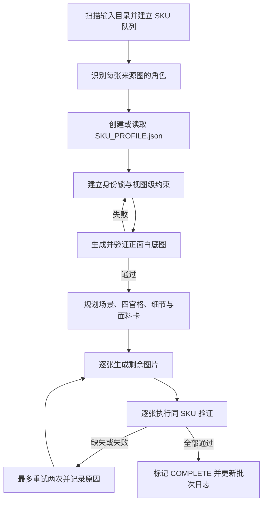

# Garment Product Image Guard

面向服装电商批量成图的 Codex Skill。它以原始 SKU 图片和 `SKU_PROFILE.json` 为事实来源，约束生成提示词、成图顺序、场景选择、文件命名与验收流程，尽量避免颜色、版型、领型、袖型、口袋、腰带、下摆、图案、Logo 和面料表现发生漂移。

> `README.md` 面向安装者和维护者；真正提供给 Codex 执行的规则以 [`SKILL.md`](SKILL.md) 为准。若两者存在差异，应先修正 README，不能削弱 `SKILL.md` 中的身份锁和验证要求。

## 适用场景

- 将非专业拍摄的服装照片复原为规范的电商白底图。
- 为同一 SKU 生成正面、背面、模特、四宫格、细节图和面料卡。
- 夜间无人值守地处理多个 SKU，并在第二天保留可追溯的结果和失败记录。
- 从中断位置继续，只补缺失或验证失败的图片。
- 审核已有图片是否仍属于同一个 SKU，而不是“相似款”。

它不是通用时尚创作提示词，也不是本地修图脚本。项目优先级是：

1. SKU 身份一致性；
2. 可验证、可追溯；
3. 批处理可恢复；
4. 画面品质与场景多样性。

## 核心能力

- **SKU 身份锁定**：把服装类别、廓形、颜色、材质、正背面结构和负面约束写入 `SKU_PROFILE.json`。
- **视图级证据绑定**：区分正面、背面、侧面、口袋、领口、腰部、面料和标签证据，避免把背面细节移动到正面。
- **提示词锁注入**：每次生成前都从档案编译 `PROMPT_LOCK_BLOCK`，不依赖“保持原款”之类的泛化描述。
- **固定八图交付**：每个完成的 SKU 输出 8 张指定图片和一份 `SKU_PROFILE.json`。
- **双阶段验证**：生成前检查提示词证据，生成后按“同一个 SKU”标准逐项验收。
- **增量恢复**：区分 `COMPLETE`、`PROFILE_MISSING`、`PARTIAL`、`INVALID` 和 `PENDING`，只重做缺失或失败文件。
- **生成来源约束**：最终图片必须来自生成式 AI；本地工具只能扫描、记录、转换和制作验证辅助材料。
- **批次日志**：记录缺失文件、失败原因、提示词锁状态、生成来源和未完成 SKU。

## 工作流程



## 固定输出

当前版本每个 SKU 必须生成 **8 张图片**：

| 文件名 | 内容 | 关键要求 |
| --- | --- | --- |
| `SKU_01_front_white.jpg` | 正面白底图 | 纯白背景、平铺展开、保持真实正面结构 |
| `SKU_02_back_white.jpg` | 背面白底图 | 纯白背景、保持背面专属结构和下摆几何 |
| `SKU_03_model.jpg` | 正面模特图 | 模特正面穿着、面部可见、真实生活化编辑场景 |
| `SKU_04_model_back.jpg` | 背面模特图 | 背面或后侧角度，面部仍需可见，背面服装信息清楚 |
| `SKU_05_four_grid.jpg` | 四宫格生活方式图 | 单张 2×2 图、同一 SKU、四位不同模特与四套搭配、三站一坐、五个中文文案块 |
| `SKU_06_detail_A.jpg` | 细节图 A | 基于已验收白底图重新生成，展示真实存在的结构细节与中文文案 |
| `SKU_07_detail_B.jpg` | 细节图 B | 与 A 选择不同的真实结构细节，不得直接裁剪来源照片 |
| `SKU_08_fabric.jpg` | 面料信息卡 | 默认 3:2 横图，左侧信息栏，右侧为占主导的近距离面料微距 |

除此之外还必须存在：

- `SKU_PROFILE.json`：当前 SKU 的事实档案、证据映射、身份锁和生成计划。
- 批次日志：默认位于输出根目录的 `batch_generation_log.md`，按时间追加，不覆盖历史记录。

只有当 8 张图片都属于 `AI_GENERATED` 或经过验证的 `AI_REUSED`、`SKU_PROFILE.json` 存在并且全部通过验证时，SKU 才能标记为完成。

## 输入目录约定

支持两种 SKU 组织方式。

### 方式一：根目录单图 SKU

```text
输入/
├── SKU001.jpg
├── SKU002.jpg
└── SKU003.png
```

每个根目录图片视为一个独立 SKU。

### 方式二：每个 SKU 一个子目录

```text
输入/
├── SKU001/
│   ├── front.jpg
│   ├── back.jpg
│   ├── pocket-detail.jpg
│   └── wash-label.jpg
└── SKU002/
    ├── image-01.jpg
    └── image-02.jpg
```

子目录中的所有图片只服务于该 SKU。不得把相邻目录的图片、标签或结构信息混用。

建议尽量提供：

- 正面全图；
- 背面全图；
- 领口、袖口、口袋、腰部、下摆等高风险细节；
- 面料近照；
- 可读的吊牌、洗标或成分标签。

来源证据不足时，skill 会采用保守推断并添加低置信度标记，而不是自动补成更常见或更美观的款式。

## 输出目录示例

```text
输出/
├── batch_generation_log.md
└── SKU001/
    ├── SKU_PROFILE.json
    ├── SKU_01_front_white.jpg
    ├── SKU_02_back_white.jpg
    ├── SKU_03_model.jpg
    ├── SKU_04_model_back.jpg
    ├── SKU_05_four_grid.jpg
    ├── SKU_06_detail_A.jpg
    ├── SKU_07_detail_B.jpg
    └── SKU_08_fabric.jpg
```

## 安装

### 从 GitHub 克隆

该仓库是私有仓库，执行克隆前需要让 Git 或 GitHub CLI 登录有访问权限的 GitHub 账号。

Windows PowerShell：

```powershell
git clone https://github.com/sdfbdsfdbg/garment-product-image-guard.git "$env:USERPROFILE\.codex\skills\garment-product-image-guard"
```

如果设置了自定义 `CODEX_HOME`：

```powershell
git clone https://github.com/sdfbdsfdbg/garment-product-image-guard.git "$env:CODEX_HOME\skills\garment-product-image-guard"
```

安装后重新打开 Codex，或启动一个新任务，使技能目录被重新扫描。

### 手动安装

把包含 `SKILL.md` 的整个目录复制到：

```text
%USERPROFILE%\.codex\skills\garment-product-image-guard\
```

不要只复制 `SKILL.md`。`references/` 和 `assets/` 中包含四宫格、面料版式及场景选择所需的规则和参考图。

## 使用方法

在 Codex 中显式调用 skill，并给出输入目录、输出目录和运行目标。例如：

```text
使用 $garment-product-image-guard 处理“输入”目录中的全部服装 SKU，
结果保存到“输出”。先检查已有文件，只补做缺失或验证失败的图片，
持续运行到队列清空，并追加批次日志。
```

单个 SKU 修复示例：

```text
使用 $garment-product-image-guard 检查输出/SKU001。
对照输入/SKU001 和 SKU_PROFILE.json，找出不属于同一 SKU 的图片，
只重新生成失败文件并记录具体失败标记。
```

人工反馈款式错误时，应明确指出事实差异，例如“后领扣被生成到前领”或“左侧系带变成了正中蝴蝶结”。skill 会先更新 `SKU_PROFILE.json` 中的纠错锁，再重新生成受影响图片。

## `SKU_PROFILE.json` 的职责

`SKU_PROFILE.json` 是每个 SKU 的结构化事实来源，不是普通日志。它至少应覆盖以下信息组：

| 信息组 | 作用 |
| --- | --- |
| `identity_lock` | 类别、廓形、正背面标志、袖型、颜色材质、负面约束和证据文件 |
| `print_lock` | 文字、图案、Logo、刺绣、色块的位置、颜色、比例和置信度 |
| `source_role_map` | 把来源图片标记为正面、背面、标签、口袋、面料等角色 |
| `view_specific_details` | 记录仅正面、仅背面、仅左侧、仅右侧或方向未知的结构 |
| `closure_lock` | 门襟、拉链、纽扣、后领开口等闭合结构 |
| `pocket_lock` | 口袋数量、位置、开口形状、角度和缝线关系 |
| `belt_lock` | 系带、腰带、扣环、腰袢、尾端方向和不对称信息 |
| `sleeve_lock` | 袖长、袖量、袖口、肩部结构和透明度 |
| `collar_lock` | 领型、领口几何、门襟关系及正背面差异 |
| `hem_lock` | 平直、弧形、高低、斜向、波浪或不对称下摆 |
| `scene_context_lock` | 模特年龄组、允许及禁止场景、选择理由和文案方向 |
| `detail_source_map` | 每张细节图的原始证据、白底渲染基准和目标构图 |
| `four_grid_plan` | 四个分镜的模特、姿势、搭配、场景、构图和中文文案 |
| `fabric_layout_plan` | 面料卡版式、成分证据、特征、缩略图基准和微距证据 |
| `confidence_flags` | 背面、文字或成分无法完全确认时的低置信度标记 |

可读标签中的成分文字属于产品事实。只有同一 SKU 的吊牌、洗标或可靠资料明确给出纤维名称和比例时，才允许在面料卡中展示成分；无法确认时应省略整个成分区块，不能猜测或写占位符。

## 状态与断点恢复

| 状态 | 含义 | 后续动作 |
| --- | --- | --- |
| `COMPLETE` | 8 张图和档案齐全且全部通过验证 | 跳过 |
| `PROFILE_MISSING` | 图片可能存在，但缺少 `SKU_PROFILE.json` | 先建立档案，再验证已有图片 |
| `PARTIAL` | 档案存在，但缺少一个或多个必需文件 | 只生成缺失文件 |
| `INVALID` | 文件存在，但至少一张未通过验证 | 只重新生成失败文件 |
| `PENDING` | 没有可用输出目录 | 从头处理该 SKU |

每张失败图片最多重试两次。达到上限后记录失败原因并继续队列，避免单个 SKU 阻塞整个夜间批次。

## 验证原则

### 生成前

- 必须列出实际使用的来源文件名和对应角色。
- 必须填入与当前视图相关的身份锁和负面约束。
- 模特图和四宫格必须具有完整 `scene_context_lock`。
- 细节图必须绑定已验收的正面或背面白底图作为主要渲染基准。
- 面料卡必须绑定固定版式、缩略图基准和面料微距证据。
- 禁止只写“保持原款”“参考原图”等泛化提示词。

### 生成后

- 标准是“同一个 SKU”，不是“看起来相似”。
- 逐项检查颜色、图案、Logo、领口、袖型、门襟、口袋、腰部、下摆、缝线和面料表现。
- 检查正背面或左右侧专属结构是否移动、镜像、消失或被通用化。
- 检查场景、姿势、裁切、光影、配饰和文案是否遮挡关键服装事实。
- 四宫格需额外检查四个不同面孔、四个不同姿势、四套不同搭配、三站一坐和恰好五个中文文案块。
- 失败时在日志中写明具体标记，不能只记录“效果不好”。

## 本地工具边界

允许本地脚本或图像库执行：

- 扫描输入输出目录；
- 读取尺寸、元数据和文件完整性；
- 创建或更新 `SKU_PROFILE.json`；
- 对已生成图片进行不改变画面内容的重命名、移动或格式转换；
- 制作接触表、放大图和其他仅用于核验的辅助材料；
- 写入批次日志。

禁止本地工具执行：

- 抠图换白底；
- 局部修图、合成、拼接或绘制文案；
- 从一张大图裁切出多个必需结果；
- 用本地扩散模型、模板引擎、脚本渲染器或截图替代生成式 AI；
- 把来源照片的裁剪结果冒充细节图或面料卡。

每个最终文件必须由真实的生成式 AI 调用独立生成，或是此前已验收且未经视觉修改的 AI 结果。

## 批次日志

日志默认追加记录：

- SKU 总数、完成数和待处理数；
- 每个 SKU 缺失或无效的文件名；
- 失败图片和具体失败原因；
- 每张图的提示词锁是否完整；
- 身份锁验收结果及失败标记；
- 生成工具、时间戳和来源状态；
- 本轮结束时仍未完成的 SKU 清单。

推荐的来源状态：

- `AI_GENERATED`：由生成式 AI 根据来源图片和 SKU 档案生成；
- `AI_REUSED`：复用此前已通过验证且没有视觉修改的 AI 图片；
- `INVALID_LOCAL_DERIVED`：由本地像素处理产生，不能作为最终交付。

## 仓库结构

```text
garment-product-image-guard/
├── SKILL.md
├── README.md
├── agents/
│   └── openai.yaml
├── references/
│   ├── fabric-layout.md
│   ├── four-grid.md
│   └── scene-context.md
└── assets/
    ├── fabric-layout-reference-01.jpg
    ├── fabric-layout-reference-02.jpg
    ├── four-grid-reference-01.jpg
    ├── four-grid-reference-02.jpg
    └── four-grid-reference-03.jpg
```

- [`SKILL.md`](SKILL.md)：核心执行合同、身份锁、工作流和验收门槛。
- [`references/four-grid.md`](references/four-grid.md)：四宫格分镜、姿势、搭配与文案规则。
- [`references/fabric-layout.md`](references/fabric-layout.md)：面料卡的固定版式和内容约束。
- [`references/scene-context.md`](references/scene-context.md)：按模特年龄选择合适场景的规则。
- `assets/`：四宫格和面料卡的视觉参考，只定义风格与版式，不定义具体 SKU 事实。
- `agents/openai.yaml`：Codex 界面展示名称、简介和默认提示词。

## 常见问题

### 为什么不能直接把原图抠成白底图？

这个 skill 的最终交付要求来自生成式 AI，并通过统一的身份锁和验证流程。传统抠图、拼接或局部修图只能作为核验辅助，不能冒充必需成图。

### 为什么已有图片还要读取 `SKU_PROFILE.json`？

图片只能展示结果，档案保存的是可比较的产品事实和证据关系。没有档案就无法稳定判断图片是否为同一个 SKU，也无法在中断后可靠地补图。

### 只有一张来源图能运行吗？

可以，但不可见视图只能保守推断并标记低置信度。来源信息越完整，正背面结构、面料与成分越可靠。

### 为什么面料卡有时没有成分？

因为成分必须来自同一 SKU 的可读标签或可靠材料数据。无法确认时，省略比猜测更安全。

### 中途断网或任务中断怎么办？

重新要求 Codex 扫描同一输入输出目录并继续即可。它应保留已通过验证的文件，只补缺失或失败项。

### 当前到底是 7 张还是 8 张？

当前合同是 **8 张**。四宫格 `SKU_05_four_grid.jpg` 已计入固定输出集合，完成条件以完整 `required_outputs` 列表为准。

## 维护检查清单

修改 skill 后至少执行以下检查：

1. 校验 `SKILL.md` 的 YAML frontmatter 和目录结构。
2. 搜索过期的固定数量、文件名和完成条件。
3. 确认 `Required Outputs`、`Missing Output Detection`、固定文件名集合和 README 输出表一致。
4. 确认 `agents/openai.yaml` 仍与 skill 的实际能力相符。
5. 阅读全部引用文件，确认链接、文件名和资产数量有效。
6. 使用真实 SKU 做一次从档案建立、首图验证、剩余生成到日志收尾的完整回归。
7. 变更图片数量时，优先让完成判定依赖 `required_outputs` 集合，而不是在多个位置重复写死数字。

可使用 Codex 自带的 skill 校验脚本检查结构：

```powershell
python -X utf8 path\to\skill-creator\scripts\quick_validate.py path\to\garment-product-image-guard
```

## 隐私与授权

- 仓库本身只保存通用 skill、规则文档和版式参考图，不应提交真实订单、SKU 批次、业务日志或客户数据。
- 输入图片、输出图片、`SKU_PROFILE.json` 和 `batch_generation_log.md` 应保留在业务工作目录中。
- 当前仓库未声明开源许可证，按私有内部项目管理；未经授权不要复制或公开分发。

